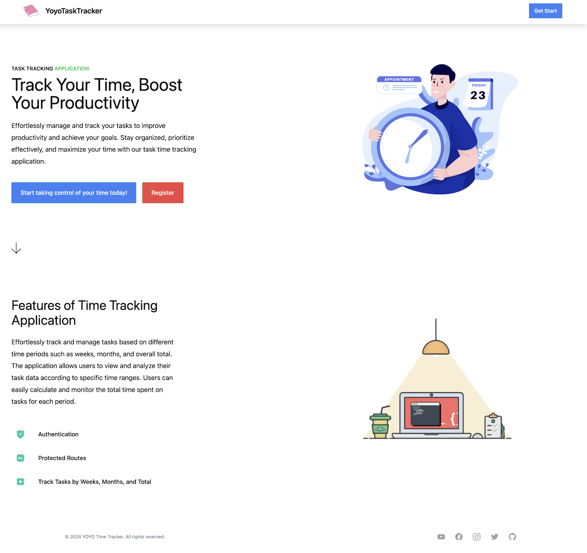

# YOYO Task Time Tracker APP

A React time-tracker application, utilizing Firebase and ReactJS, which enables users to log task duration by adjusting task statuses. This application employs Firebase as its backend to handle customer authentication and manage real-time databases, utilizing Firebase's CRUD operations.

# Deploy Link

## https://yoyotasktracker.netlify.app/

# tech track

1. Styling: tailwind css
2. Navigation: react-router dom
3. Backend: NodeJS and Firebase
4. Frontend: ReactJS

# Key Features:

1. Users can directly log into the app using their Google email
2. Customers can manage tasks' status and view the total time spent weekly and monthly on created tasks
3. Users can export the task list.

